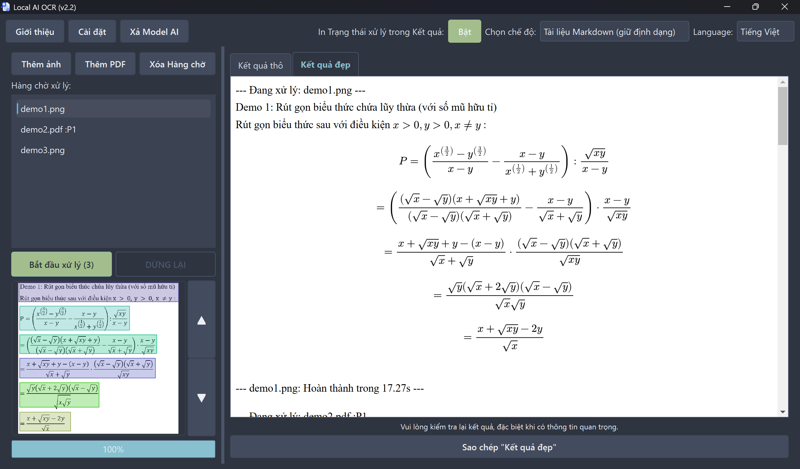

### Ngôn ngữ:
[Tiếng Việt](README.md) |
[English](README_en.md)

# Local AI OCR (v2.2)

Một phần mềm OCR **nội bộ**, **offline** (sau khi thiết lập lần đầu), **portable**, có thể xử lý ảnh và tệp PDF, sử dụng AI *DeepSeek-OCR* (chạy nội bộ trực tiếp trên máy).

## Tính năng

- **Chạy offline (nội bộ):** **Không cần kết nối mạng, cũng chả liên lạc đi đâu**, đảm bảo bảo mật dữ liệu tuyệt đối.
- **Hỗ trợ GPU (và CPU):** Tự động phát hiện và sử dụng GPU để tăng tốc, nếu không thể sử dụng GPU thì tự động chuyển sang CPU (CPU sẽ chậm hơn nhiều).
- **Hỗ trợ đa ngôn ngữ:** Tiếng Việt, Tiếng Anh, Tiếng Trung, Tiếng Nhật, ...
- **Hỗ trợ nhiều định dạng tệp:** Ảnh `.png`, `.jpg`, `.webp`, `.heic`, `.heif` và Tài liệu `.pdf`.
- **Xử lý PDF thông minh:** Cho phép chọn phạm vi trang để xử lý (với các tệp PDF >=2 trang).
- **Hệ thống Hàng chờ:** Cho phép xử lý lần lượt nhiều tệp.
- **Kết quả đẹp:** Hỗ trợ hiển thị kết quả có định dạng thay vì văn bản thô, **cho phép giữ nguyên định dạng** để dán vào Word, ...
- **Hình minh họa quá trình OCR:** Nhìn thấy AI đang đọc đến đoạn nào bằng cách nhìn hộp bao quanh. (khá ngầu).
- **Có 3 chế độ xử lý:**
  - **Tài liệu Markdown (giữ định dạng):** Trích xuất văn bản, cố gắng giữ bố cục (Table, ...)
  - **OCR Tự do (Free OCR):** Trích xuất văn bản, giữ bố cục tốt hơn "`OCR Tiêu chuẩn`".
  - **OCR Tiêu chuẩn:** Trích xuất văn bản, giữ bố cục không tốt.
- **Giao diện tự động phát hiện Ngôn ngữ:** dựa vào việc máy có `Cốc Cốc` hoặc `Zalỏ` hay không.
- **Tự động xả Model AI để giải phóng bộ nhớ:** Sau khi "`Bắt đầu xử lý`" lần đầu thì Model AI sẽ được nạp vào bộ nhớ, sau khi hoàn thành đợi 5 phút thì bộ nhớ sẽ tự được giải phóng (Hoặc nhấn nút "`Xả Model AI` để giải phóng bộ nhớ ngay).

## Yêu cầu hệ thống (khuyến nghị)

- **Lưu ý:** Bạn vẫn có thể chạy phần mềm này mặc dù không đạt yêu cầu hệ thống (**thậm chí không GPU vẫn chạy được**), nhưng tốc độ sẽ chậm hơn nhiều.

- **OS:** Windows 10 trở lên
- **CPU:** Tối thiểu 4 lõi/8 luồng
- **RAM:** Tối thiểu 16GB
- **Dung lượng trống:** Khoảng 11GB
- **GPU:** Có GPU (nên dùng Nvidia), với tối thiểu 8GB VRAM
  - **Lưu ý:** Phần mềm sẽ cố dùng GPU, thậm chí khi dung lượng VRAM không đạt yêu cầu để tăng tốc phần mềm.

## Tải về và thiết lập

0. Tải file `.zip` trong mục Releases (bên phải, dưới About), giải nén nó ra
1. Chạy `env_setup.cmd`
   - **Lưu ý:** Script này sẽ tải về file (weights) AI nặng 6.67 GB

- Bạn đã hoàn thành việc thiết lập phần mềm, phần mềm sẽ không cần kết nối mạng nữa.

## Lưu ý trước khi sử dụng

- Vì giới hạn kỹ thuật, AI OCR **có thể bị kẹt** trong vòng lặp vô hạn. Nếu chuyện đó xảy ra, hãy nhấn **DỪNG LẠI**.
- Mặc dù `DeepSeek-OCR` có độ chính xác cực cao, bạn **vẫn nên kiểm tra lại kết quả**, đặc biệt với tài liệu quan trọng.
- Lần chạy đầu tiên luôn tốn một chút thời gian để load AI Model vào bộ nhớ.
- Việc kéo và thả các tệp tin có thể sẽ không giữ lại thứ tự tệp, đây là giới hạn phần mềm và hiện không có cách khắc phục.

## Hướng dẫn sử dụng

1. **Khởi động phần mềm:**
   - Chạy file `run.cmd` để khởi động phần mềm (sử dụng GPU nếu có thể).
   - Nếu bạn muốn ép phần mềm chạy bằng CPU, hãy dùng `run_cpu-only.cmd`.

2. **Sử dụng phần mềm:**
   - **2a. Quản lý tệp tin:**
      + Thêm ảnh/Thêm PDF: Chọn trang tài liệu cần xử lý để thêm vào `Hàng chờ xử lý`.
      + Xóa Hàng chờ: Xóa sạch danh sách `Hàng chờ xử lý`.
   - **2b. Chọn chế độ (nên giữ mặc định):** Chọn giữa 3 chế độ OCR, mặc định là tốt nhất.
      - **Lưu ý:** Nếu chế độ mặc định không in ra gì cả (hình bạn đưa quá phức tạp), thì hãy thử chế độ "`OCR Tự do (Free OCR)`".
   - *Mẹo:* Nếu bạn không muốn những dòng như `--- Đang xử lý: demo1.png ---` xuất hiện trong `Kết quả` thì hãy tắt "`In Trạng thái xử lý trong Kết quả:`".
   - **2c. Bắt đầu OCR:** Nhấn nút "`Bắt đầu xử lý`" để bắt đầu OCR.
   - **2d. Kết quả:** Văn bản sau khi được xử lý sẽ hiển thị nội dung ở khung bên phải, bạn nên nhìn bên "`Kết quả đẹp`" (phần mềm sẽ tự chuyển qua Thẻ đó khi OCR kết thúc).
   - **2e. Sao chép kết quả:** Nhấn nút này để sao chép nội dung trong ô "`Kết quả`", Nếu bạn đang ở Thẻ "`Kết quả đẹp`" thì định dạng sẽ được giữ nguyên, bạn có thể dán vào Word hoặc phần mềm khác.

- *Mẹo*: Nhấn nút "`Xả Model AI`" giúp giải phóng RAM/VRAM khi bạn không có ý định tiếp tục sử dụng OCR, nhưng lại chưa muốn tắt phần mềm.

## Xử lý vấn đề

- Nếu bạn gặp lỗi liên quan đến GPU, hãy dùng `run_wlog.cmd` để xem log lỗi, hoặc dùng `run_cpu-only.cmd` để phần mềm không sử dụng GPU.
- Chế độ "`Tài liệu Markdown (giữ định dạng)`" không in ra gì cả: Hãy thử chế độ "`OCR Tự do (Free OCR)`".