# Local AI OCR (v2.2)

## Tech Stack
- **wget2:** `2.2.0`
- **Python:** Embeddable Python `3.13.11`
- **Ollama:** `0.13.4`
- **deepseek-ocr:3b:** `0e7b018b8a22`
- **Frontend:** PySide6 `6.10.1`
- **src/res/node/mathjax:** `4.0.0`
- **src/res/node/@mathjax/mathjax-newcm-font:** `4.0.0`

## Architecture

```mermaid
graph TD
    %% ==================== Entry Point ====================
    subgraph Entry["Entry Point"]
        main_py["main.py"]
        main_fn["main()"]
        load_stylesheet["load_stylesheet()"]
    end

    main_py --> main_fn
    main_fn --> load_stylesheet

    %% ==================== Configuration ====================
    subgraph Config["config.py"]
        cfg_const["Constants:<br/>APP_VERSION, APP_ID, APP_AUTHOR<br/>PROJECT_URL, CONFIG_TOML_PATH<br/>WIN_TASKBAR_PROGRESS_SUPPORT<br/>DEFAULT_OLLAMA_IP/PORT/MODEL<br/>IMAGE_EXTENSIONS<br/>INFERENCE_PARAMS, PROMPTS<br/>DEFAULT_PROMPT"]
        cfg_runtime["Runtime Globals:<br/>OLLAMA_HOST, OLLAMA_MODEL"]
        cfg_load["load_user_config()"]
        cfg_save["save_user_config()"]
        cfg_reload["reload_config()"]
    end

    cfg_load -.-> cfg_runtime
    cfg_reload --> cfg_load

    %% ==================== Language Handler ====================
    subgraph LangHandler["lang_handler.py"]
        lang_const["LANGUAGES dict"]
        get_default_language["get_default_language()"]
        get_available_languages["get_available_languages()"]
        load_language["load_language()"]
    end

    get_available_languages --> lang_const

    %% ==================== File Handler ====================
    subgraph FileHandler["file_handler.py"]
        fh_const["pillow_heif.register_heif_opener()<br/>Image.MAX_IMAGE_PIXELS = None"]
        preprocess_image["preprocess_image()"]
        get_image_bytes["get_image_bytes()"]
        get_pdf_page_count["get_pdf_page_count()"]
        extract_pdf_page_bytes["extract_pdf_page_bytes()"]
    end

    get_image_bytes --> preprocess_image
    extract_pdf_page_bytes --> preprocess_image

    %% ==================== Ollama Service ====================
    subgraph OllamaService["ollama_service.py"]
        stream_ocr_response["stream_ocr_response()"]
        check_connection["check_connection()"]
        check_model_installed["check_model_installed()"]
        
        subgraph PreCheckWorkerClass["class PreCheckWorker(QThread)"]
            pcw_init["__init__(client, model_name)"]
            pcw_run["run()"]
            pcw_signal["Signal: finished(bool, str, str)"]
        end
        
        subgraph ModelUnloadWorkerClass["class ModelUnloadWorker(QThread)"]
            muw_init["__init__(client)"]
            muw_run["run()"]
            muw_signal["Signal: finished(bool, str)"]
        end
    end

    pcw_run --> check_connection
    pcw_run --> check_model_installed
    muw_run -.-> cfg_runtime

    %% ==================== OCR Worker ====================
    subgraph OCRWorkerModule["ocr_worker.py"]
        ocr_const["pattern_pair (regex)<br/>grounding_mode logic"]
        
        subgraph OCRWorkerClass["class OCRWorker(QThread)"]
            ocr_init["__init__(client, queue_items,<br/>prompt, model_name, prompt_id)"]
            ocr_run["run()"]
            ocr_process_chunk["process_chunk()"]
            ocr_stop["stop()"]
            ocr_signals["Signals:<br/>stream_chunk(str)<br/>image_started(str, int)<br/>image_finished(str, float)<br/>box_detected(list)<br/>finished_all()<br/>error_occurred(str)"]
        end
    end

    ocr_run --> stream_ocr_response
    ocr_run --> get_image_bytes
    ocr_run --> extract_pdf_page_bytes
    ocr_run --> ocr_process_chunk
    ocr_run -.-> cfg_const

    %% ==================== Windows Taskbar ====================
    subgraph WinTaskbar["win_taskbar.py (Windows only)"]
        wt_const["CLSID_TaskbarList<br/>IID_ITaskbarList3<br/>TBPF_NOPROGRESS/NORMAL/etc"]
        
        subgraph GUIDClass["class GUID(Structure)"]
            guid_init["__init__(guid_str)"]
        end
        
        subgraph ITaskbarList3Class["class ITaskbarList3(Structure)"]
            itl3_fields["lpVtbl pointer"]
        end
        
        subgraph ITaskbarList3VtblClass["class ITaskbarList3Vtbl(Structure)"]
            vtbl_fields["IUnknown methods<br/>ITaskbarList methods<br/>ITaskbarList2 methods<br/>SetProgressValue()<br/>SetProgressState()"]
        end
        
        subgraph TaskbarProgressClass["class TaskbarProgress"]
            tbp_init["__init__()"]
            tbp_init_com["_init_com()"]
            tbp_set_progress["set_progress(hwnd, current, total)"]
            tbp_stop_progress["stop_progress(hwnd)"]
        end
    end

    tbp_init --> tbp_init_com
    tbp_init_com --> guid_init
    tbp_init_com -.-> wt_const
    tbp_set_progress --> vtbl_fields
    tbp_stop_progress --> vtbl_fields

    %% ==================== UI: Main Window ====================
    subgraph MainWindowModule["ui/main_window.py"]
        subgraph MainWindowClass["class MainWindow(QMainWindow)"]
            mw_init["__init__(ollama_client)"]
            mw_showEvent["showEvent()"]
            mw_force_gl_init["force_gl_init()"]
            mw_init_ui["init_ui()"]
            mw_show_about["show_about()"]
            mw_show_settings["show_settings()"]
            mw_unload_model["unload_model()"]
            mw_on_unload_finished["on_unload_finished()"]
            mw_update_header_toggle["update_header_toggle_text()"]
            mw_change_language["change_language()"]
            mw_apply_language["apply_language()"]
            mw_set_processing_state["set_processing_state()"]
            mw_initiate_processing["initiate_processing()"]
            mw_on_precheck_finished["on_precheck_finished()"]
            mw_start_processing["start_processing()"]
            mw_stop_processing["stop_processing()"]
            mw_on_image_started["on_image_started()"]
            mw_on_image_finished["on_image_finished()"]
            mw_on_finished["on_finished()"]
            mw_resizeEvent["resizeEvent()"]
            mw_validate_dropped["_validate_dropped_files()"]
            mw_dnd["dragEnterEvent()<br/>dragMoveEvent()<br/>dragLeaveEvent()<br/>dropEvent()"]
        end
    end

    mw_init --> mw_init_ui
    mw_init --> mw_apply_language
    mw_init -.-> cfg_const
    mw_showEvent --> mw_force_gl_init
    mw_init_ui --> ControlPanelClass
    mw_init_ui --> OutputPanelClass
    mw_apply_language --> load_language
    mw_apply_language --> cp_update_language
    mw_apply_language --> op_update_language
    mw_change_language --> mw_apply_language
    mw_show_settings --> SettingsDialogClass
    mw_unload_model --> ModelUnloadWorkerClass
    mw_on_unload_finished -.-> muw_signal
    mw_initiate_processing --> PreCheckWorkerClass
    mw_on_precheck_finished -.-> pcw_signal
    mw_on_precheck_finished --> mw_start_processing
    mw_start_processing --> OCRWorkerClass
    mw_start_processing --> mw_set_processing_state
    mw_stop_processing --> ocr_stop
    mw_on_image_started --> tbp_set_progress
    mw_on_image_started --> cp_on_process_started
    mw_on_image_finished --> cp_increment_progress
    mw_on_image_finished --> tbp_set_progress
    mw_on_finished --> tbp_stop_progress
    mw_on_finished --> op_render_fancy
    mw_dnd --> mw_validate_dropped
    mw_dnd --> cp_add_image_files
    mw_dnd --> cp_add_pdf_files
    mw_dnd -.-> cfg_const

    %% Signal connections from OCRWorker
    ocr_signals -.-> mw_on_image_started
    ocr_signals -.-> mw_on_image_finished
    ocr_signals -.-> mw_on_finished
    ocr_signals -.-> op_append_text
    ocr_signals -.-> cp_on_stream_chunk
    ocr_signals -.-> cp_draw_box

    %% ==================== UI: Control Panel ====================
    subgraph ControlPanelModule["ui/control_panel.py"]
        subgraph ControlPanelClass["class ControlPanel(QWidget)"]
            cp_init["__init__(parent)"]
            cp_update_language["update_language(t)"]
            cp_update_status["update_status()"]
            cp_set_processing_state["set_processing_state()"]
            cp_add_images["add_images()"]
            cp_add_image_files["add_image_files(filepaths)"]
            cp_add_pdf["add_pdf()"]
            cp_add_pdf_files["add_pdf_files(filepaths)"]
            cp_move_up["move_selection_up()"]
            cp_move_down["move_selection_down()"]
            cp_clear_queue["clear_queue()"]
            cp_on_queue_item_changed["on_queue_item_changed()"]
            cp_perform_load_image["_perform_load_image()"]
            cp_on_image_loaded["on_image_loaded()"]
            cp_on_start_click["on_start_click()"]
            cp_on_stop_click["on_stop_click()"]
            cp_on_process_started["on_process_started(index)"]
            cp_on_stream_chunk["on_stream_chunk(text)"]
            cp_draw_box["draw_box(coords)"]
            cp_increment_progress["increment_progress()"]
            cp_signals["Signals:<br/>start_requested(list)<br/>stop_requested()"]
        end
    end

    cp_init --> ImageViewerClass
    cp_init -.-> cfg_const
    cp_add_images --> cp_add_image_files
    cp_add_pdf --> cp_add_pdf_files
    cp_add_pdf_files --> get_pdf_page_count
    cp_add_pdf_files --> PageRangeDialogClass
    cp_on_queue_item_changed --> cp_perform_load_image
    cp_perform_load_image --> ImageLoaderClass
    cp_on_image_loaded --> iv_display_image
    cp_on_process_started --> iv_display_image
    cp_draw_box --> iv_draw_box

    %% ==================== UI: Output Panel ====================
    subgraph OutputPanelModule["ui/output_panel.py"]
        op_const["BASE_HTML template<br/>MATHJAX_PATH"]
        balance_latex["balance_latex_delimiters()"]
        
        subgraph FancyOutputClass["class FancyOutput(QWebEngineView)"]
            fo_init["__init__(parent)"]
            fo_set_markdown["set_markdown(md_content)"]
            fo_replace_math["replace_math(match)"]
            fo_copy_content["copy_content()"]
            fo_contextMenuEvent["contextMenuEvent()"]
        end
        
        subgraph OutputPanelClass["class OutputPanel(QWidget)"]
            op_init["__init__(parent)"]
            op_update_language["update_language(t)"]
            op_update_copy_button["_update_copy_button_text()"]
            op_append_text["append_text(text)"]
            op_render_fancy["render_fancy_output()"]
            op_clear["clear()"]
            op_copy_output["copy_output()"]
        end
    end

    op_init --> FancyOutputClass
    op_render_fancy --> fo_set_markdown
    fo_set_markdown --> balance_latex
    fo_set_markdown --> fo_replace_math
    fo_set_markdown -.-> op_const

    %% ==================== UI: Image Viewer ====================
    subgraph ImageViewerModule["ui/image_viewer.py"]
        subgraph ImageViewerClass["class ImageViewer(QGraphicsView)"]
            iv_init["__init__(parent)"]
            iv_display_image["display_image(image_bytes)"]
            iv_draw_box["draw_box(coords, color)"]
            iv_fit_content["fit_content()"]
            iv_resizeEvent["resizeEvent()"]
        end
    end

    iv_display_image --> iv_fit_content
    iv_resizeEvent --> iv_fit_content

    %% ==================== UI: Image Loader ====================
    subgraph ImageLoaderModule["ui/image_loader.py"]
        subgraph ImageLoaderClass["class ImageLoaderThread(QThread)"]
            il_init["__init__(path, page_index, parent)"]
            il_run["run()"]
            il_cancel["cancel()"]
            il_signals["Signals:<br/>image_loaded(bytes)<br/>error_occurred(str)"]
        end
    end

    il_run --> get_image_bytes
    il_run --> extract_pdf_page_bytes

    %% ==================== UI: Dialogs ====================
    subgraph DialogsModule["ui/dialogs.py"]
        subgraph PageRangeDialogClass["class PageRangeDialog(QDialog)"]
            prd_init["__init__(filename, total_pages,<br/>translations, parent)"]
            prd_validate["validate_and_accept()"]
            prd_get_range["get_range()"]
        end
    end

    %% ==================== UI: Settings Dialog ====================
    subgraph SettingsModule["ui/settings_dialog.py"]
        subgraph SettingsDialogClass["class SettingsDialog(QDialog)"]
            sd_init["__init__(translations, parent)"]
            sd_restore["restore_defaults()"]
            sd_apply["apply_settings()"]
        end
    end

    sd_init --> cfg_load
    sd_restore -.-> cfg_const
    sd_apply --> cfg_save
    sd_apply --> cfg_reload

    %% ==================== Main Entry Connections ====================
    main_fn --> MainWindowClass
    main_fn --> TaskbarProgressClass
    main_fn -.-> cfg_const
```



## Environment setup

### Automated
- Execute `env_setup.cmd`.

### Manual
1. **Python:**
   - Download [Python 3.13.9 Embeddable (Windows x64)](https://www.python.org/ftp/python/3.13.9/python-3.13.9-embed-amd64.zip).
   - Extract to `python/`.
   - Edit `python/python313._pth`: Uncomment line 5: `import site`.

2. **pip + requirements:**
   - Download [get-pip.py](https://bootstrap.pypa.io/get-pip.py).
     ```powershell
     .\python\python.exe get-pip.py
     .\python\python.exe -m pip install -r requirements.txt
     ```

3. **Ollama:**
   - Download [ollama-windows-amd64.zip](https://ollama.com/download/ollama-windows-amd64.zip).
   - Extract to `ollama/`.

4. **DeepSeek-OCR Model:**
   ```powershell
   $env:OLLAMA_HOST = "127.0.0.1:11435" # Avoid port conflict
   $env:OLLAMA_MODELS = Join-Path $PSScriptRoot "models"
   .\ollama\ollama.exe pull deepseek-ocr:3b
   ```

## Running
- **With GPU (If possible):** `run.cmd`
- **With GPU (+ Logging):** `run_wlog.cmd`
- **CPU-Only Mode:** `run_cpu-only.cmd`
- **CPU-Only Mode (+ Logging):** `run_cpu-only_wlog.cmd`

## Packaging
- Execute `make_release.cmd` to create release zip.

## Debloating `src/res/node/mathjax` and `src/res/node/@mathjax/mathjax-newcm-font`
```
./core.js
./loader.js
./startup.js
./mml-chtml-nofont.js
./mml-chtml.js
./mml-svg-nofont.js
./mml-svg.js
./tex-chtml-nofont.js
./tex-chtml.js
./tex-mml-chtml-nofont.js
./tex-mml-chtml.js
./tex-mml-svg-nofont.js
./tex-svg-nofont.js
./tex-svg.js
./input/asciimath.js
./input/mml.js
./input/tex.js
./input/tex-base.js
./input/mml/
./output/
./ui/
./chtml/
./examples/
```