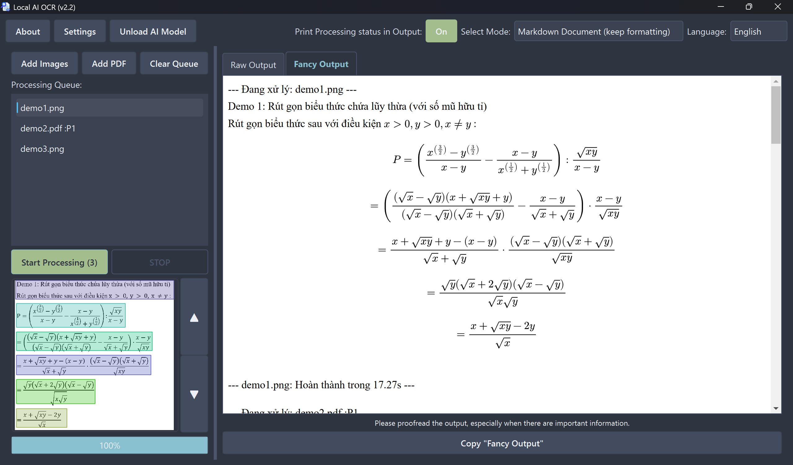

### Languages:
[English](README_en.md) |
[Tiếng Việt](README.md)

# Local AI OCR (v2.2)

An **local**, **offline** (after initial setup), **portable** OCR software that can process images and PDF files, using *DeepSeek-OCR* AI (running directly on your machine).

## Features

- **Runs offline (locally):** **No network connection required, and it doesn't communicate anywhere**, ensuring absolute data security.
- **GPU (and CPU) support:** Automatically detects and uses GPU for acceleration; if GPU is not available, it automatically switches to CPU (CPU will be much slower).
- **Multi language support:** English, Vietnamese, Chinese, Japanese, ...
- **Multiple file format support:** Images `.png`, `.jpg`, `.webp`, `.heic`, `.heif` and `.pdf` documents.
- **Smart PDF processing:** Allows selecting page range for processing (for PDF files with >=2 pages).
- **Queue system:** Allows processing multiple files sequentially.
- **Fancy Output:** Supports displaying Formatted text instead of raw text, **allows keeping formatting** for pasting into Word, ...
- **OCR process illustration:** See exactly what the AI detected as OCR progresses (pretty cool).
- **3 processing modes:**
  - **Markdown Document (keep formatting):** Extracts text, attempts to preserve layout (Tables, ...)
  - **Free OCR:** Extracts text, preserve layout better than "`Standard OCR`".
  - **Standard OCR:** Extracts text, does not preserve layout well.
- **Auto-unload AI Model to free memory:** After the first "`Start Processing`", the AI Model will be loaded into memory; after completion, it will automatically free memory after 5 minutes (Or press the "`Unload AI Model`" button to free memory immediately).

## System Requirements (Recommended)

- **Note:** You can still run this software even if you don't meet the system requirements (**even without a GPU, it still works**), but the speed will be much slower.

- **OS:** Windows 10 or later
- **CPU:** Minimum 4 cores/8 threads
- **RAM:** Minimum 16GB
- **Free storage:** About 11GB
- **GPU:** GPU available (Nvidia recommended), with minimum 8GB VRAM
  - **Note:** The software will try to use the GPU, even when VRAM capacity doesn't meet requirements, to accelerate the software.

## Download and Setup

0. Download the `.zip` file from the Releases section (on the right, under About), extract it
1. Run `env_setup.cmd`
   - **Note:** This script will download the AI weights file, which is 6.67 GB

- You have completed the software setup; the software will no longer need a network connection.

## Notes Before Use

- Due to technical limitations, the AI OCR **may get stuck** in an infinite loop. If that happens, press **STOP**.
- Although `DeepSeek-OCR` has extremely high accuracy, you **should still verify the results**, especially for important documents.
- The first run always takes some time to load the AI Model into memory.
- Dragging and dropping files may not preserve the file order, this is a software limitation and there is currently no way to fix it.

## Usage Guide

1. **Launch the software:**
   - Run the `run.cmd` file to start the software (uses GPU if available).
   - If you want to force the software to run on CPU, use `run_cpu-only.cmd`.

2. **Using the software:**
   - **2a. File management:**
      + Add Image/Add PDF: Select document pages to add to the `Processing Queue`.
      + Clear Queue: Clear the `Processing Queue` list.
   - **2b. Select mode (recommended to keep default):** Choose between 3 OCR modes, default is the best.
      - **Note:** If the default mode doesn't output anything (image you provided is too complex), try selecting "`Free OCR`".
   - *Tip:* If you don't want lines such as `--- Processing: demo1.png ---` appearing in your `Output` then turn off "`Print Processing status in Output:`". 
   - **2c. Start OCR:** Press the "`Start Processing`" button to begin OCR.
   - **2d. Output:** The processed text will be displayed in the right panel; you should look at "`Fancy Output`" (the software will automatically switch to that Tab when OCR finishes).
   - **2e. Copy output:** Press this button to copy the content in the "`Output`" box. If you're on the "`Fancy Output`" Tab, the formatting will be preserved, and you can paste it into Word or other software.

- *Tip*: Press the "`Unload AI Model`" button to free RAM/VRAM when you don't intend to continue using OCR but don't want to close the software yet.

## Troubleshooting

- If you encounter GPU-related errors, use `run_wlog.cmd` to view error logs, or use `run_cpu-only.cmd` so the software won't use the GPU.

- "`Markdown Document (keep formatting)`" doesn't output anything: try using "`Free OCR`" mode.